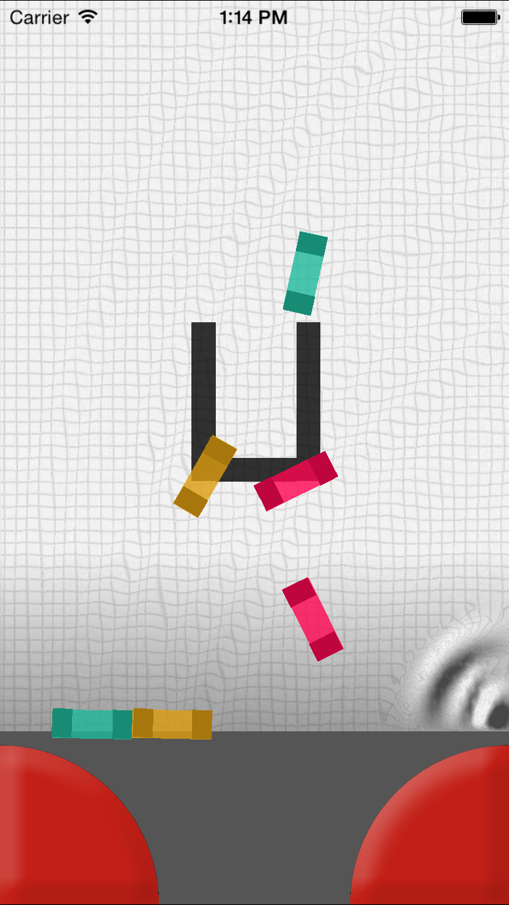

# aquaplay
## Concept
This game replicates an Aquaplay toy using only the UIKit. It was made as a kind of challenge, stretching the UIKit as far as possible to create a game, without using any other frameworks (a.k.a. SpriteKit).

## Screenshots

